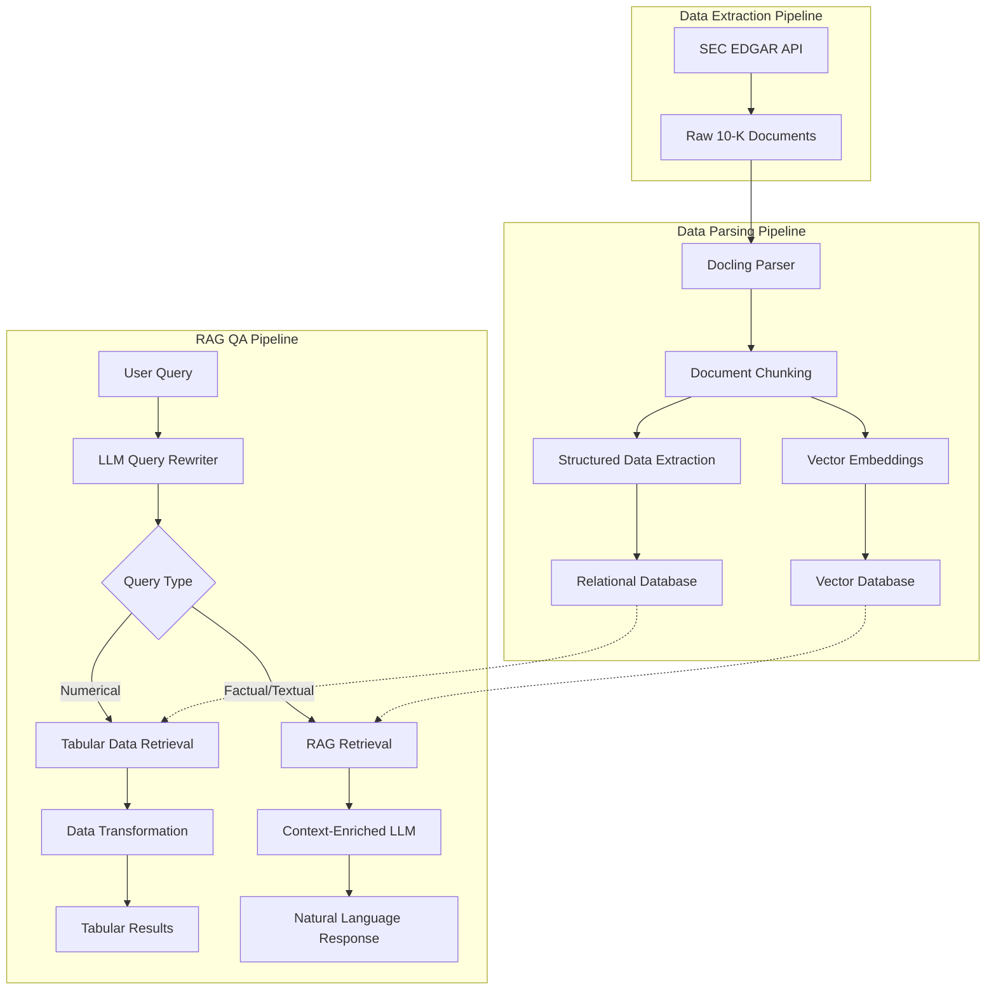

```mermaid
graph TD
    %% Data Extraction Pipeline
    subgraph Data Extraction Pipeline
        A[SEC EDGAR API] --> B[Raw 10-K Documents]
    end

    %% Data Parsing Pipeline - showing with more horizontal space
    subgraph Data Parsing Pipeline
        C[Docling Parser]
        D[Document Chunking]
        E1[Vector Embeddings]
        E2[Structured Data Extraction]
        F1[Vector Database]
        F2[Relational Database]

        C --> D
        D --> E1
        D --> E2
        E1 --> F1
        E2 --> F2
    end

    %% RAG QA Pipeline
    subgraph RAG QA Pipeline
        G[User Query]
        H[LLM Query Rewriter]
        I{Query Type}
        J1[RAG Retrieval]
        J2[Tabular Data Retrieval]
        K1[Context-Enriched LLM]
        K2[Data Transformation]
        L[Tabular Results]
        M[Natural Language Response]

        G --> H
        H --> I
        I -->|Factual/Textual| J1
        I -->|Numerical| J2
        J1 --> K1
        J2 --> K2
        K2 --> L
        K1 --> M
    end

    %% Connections between subgraphs
    B --> C
    F1 -.-> J1
    F2 -.-> J2  
```